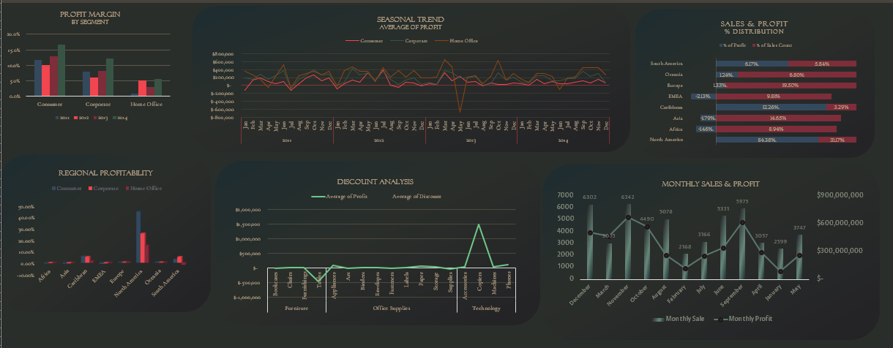
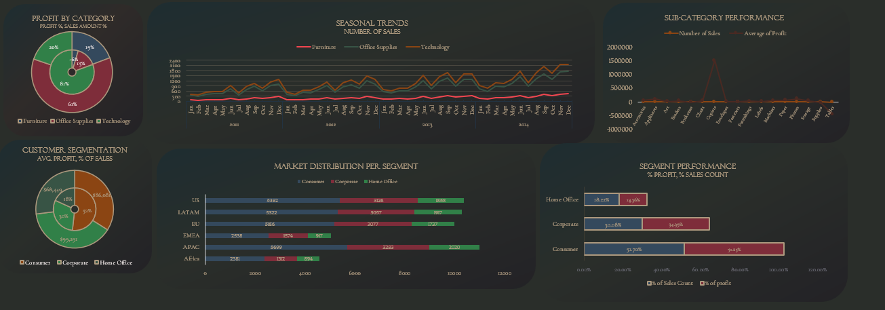
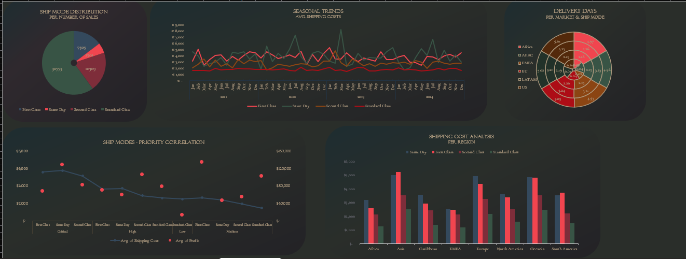

This work is the completion project of the Excel module of my training at Kodlasam, focusing on data analysis and visualization skills using Microsoft Excel and the Superstore sales dataset. The goal was to make this dataset more understandable, and obviously, my data analysis skills 💪 *flexible* 💪.

## Data Source

Superstore sales dataset, which can be found on [Kaggle](https://www.kaggle.com/datasets/rohitsahoo/sales-forecasting).

## Dashboards

*   **Profit Margin Analysis:** Exploring profit margins by customer segment, seasonal profit trends, regional profitability, the impact of discounts on profit, and monthly sales and profit fluctuations.
       

    *   **Key Insights:**
        *   Varying Segment Profitability: Profit margins differ significantly across customer segments (Consumer, Corporate, Home Office), segment targeting strategies should be revisited.
        *   Seasonal Profit Trends: Average profit exhibits seasonal patterns across all segments, with potential peaks and dips throughout the year.
        *   Regional Profit Disparities: Regional profitability varies considerably, with some regions (e.g., North America) contributing a significantly larger share of profits.
        *   Impact of Discounts on Profit: The discount analysis reveals a negative correlation between discounts and average profit, particularly for certain product categories.
        *   Monthly Sales and Profit Fluctuations: Monthly sales and profit exhibit fluctuations, with potential peaks during specific months.
        *   Asia and Africa Profitability Concerns: Asia and Africa shows negative profitability percentages.
 

*   **Marketing Analysis:** Revisiting *profit* by category, seasonal sales trends, sub-category performance, customer segmentation, market distribution per segment, and segment performance.
       

    *   **Key Insights:**
        *   Technology Drives Profit: The Technology category accounts for the largest share of profit (61%), despite a smaller percentage of sales amount.
        *   Seasonal Sales Trends: Sales trends vary seasonally across product categories, with potential peaks and dips throughout the year.
        *   Copiers Impact: Copiers sub-category stands out with a negative average profit.
        *   Consumer Segment Dominance: The Consumer segment contributes the largest share of both sales and profit.
        *   US Market Share: The US market has the highest distribution per segment.
        *   Segment Performance Discrepancy: There is a discrepancy between the percentage of sales count and the percentage of profit for each segment, worth delving.

*   **Shipping Analysis:** Displaying shipping mode distribution, seasonal trends in shipping costs, delivery days by region, and the correlation between shipping costs and profit.
       

    *   **Key Insights:**
        *   Dominant Standard Class: Standard Class shipping accounts for the vast majority of sales (79%), highlighting its importance for overall order fulfillment.
        *   Seasonal Cost Fluctuations: Average shipping costs fluctuate throughout the year, with potential peaks during certain months.
        *   Regional Delivery Time Variance: Delivery times vary across regions, indicating potential logistical challenges or inefficiencies in specific markets.
        *   Cost-Profit Trade-off: Higher shipping costs (e.g., Same Day) are associated with lower average profit margins.
        *   Regional Cost Disparities: Shipping costs vary significantly by region, suggesting opportunities for cost optimization through carrier negotiation or alternative shipping strategies.
        *   Same Day Shipping Impact: Same Day shipping is the most expensive option across all regions, with a potentially significant impact on profit margins.
